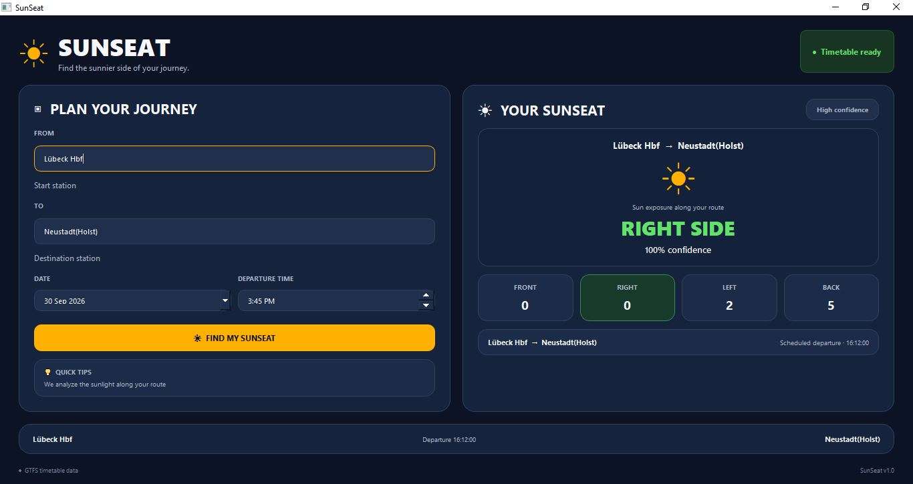

# SunSeat ☀️🚆

SunSeat is a Python desktop application that recommends which side of a train to sit on based on the direction of sunlight during a journey.

The application combines **GTFS timetable data**, **geographic route bearings**, and **solar-position calculations** to estimate whether sunlight is predominantly on the left or right side of the train.



## What it does

- Search for a journey between two stations.
- Match a suitable trip from GTFS stop-time data.
- Build the route from the selected trip's stops and coordinates.
- Calculate the train's direction for each route segment.
- Calculate the sun's azimuth and elevation for the relevant time and location.
- Classify visible sunlight relative to the train as front, right, left, or back.
- Aggregate left/right exposure and provide a seat-side recommendation with a confidence value.
- Cache GTFS data in memory to improve repeated searches.
- Provide a desktop interface built with PySide6.

## Key technologies

- Python
- PySide6
- GTFS
- Astral
- Pytest
- Geographic and solar-position calculations
- In-memory caching for repeated GTFS searches

## Project structure

```text
SunSeat/
├── app.py                         # Application/service layer
├── gui.py                         # PySide6 desktop interface
├── engine/
│   ├── __init__.py
│   ├── geography.py               # Bearings and journey-level sun analysis
│   ├── gtfs_reader.py             # GTFS loading, station and trip search
│   ├── recommendation.py          # Seat-side recommendation logic
│   ├── relative_position.py       # Relative sun/train position helpers
│   └── sun_position.py            # Solar-position calculation
├── tests/
│   ├── test_app.py
│   ├── test_engine.py
│   ├── test_geography.py
│   ├── test_gtfs_reader.py
│   ├── test_recommendation.py
│   └── test_sun_position.py
├── data/
│   └── DE-RV/
│       └── README.md              # Instructions for local GTFS data
├── requirements.txt
└── README.md
